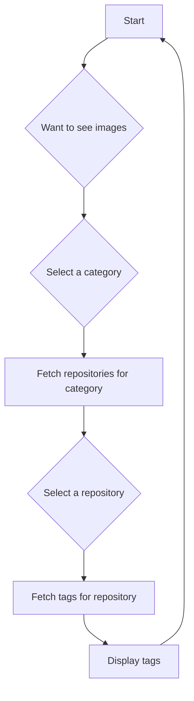

# Docker Hub API Documentation

This document outlines the Docker Hub API endpoints that will be used by the WhaleWatcher application.

## API Flow



## Public Repositories

### `GET /v2/namespaces/{namespace}/repositories`

This endpoint lists repositories in a given namespace. This can be used to list repositories in a category, for example `library` for official images.

**Parameters:**

-   `namespace`: The namespace to list repositories from.

**Query Parameters:**

-   `page`: Page number to get. Defaults to 1.
-   `page_size`: Number of items to get per page. Defaults to 10. Max of 100.
-   `name`: Filter repositories by name (partial match).
-   `ordering`: Order repositories by `name`, `last_updated`, or `pull_count`. Prefix with `-` for descending order.

**Example Response:**

```json
{
  "count": 287,
  "next": "https://hub.docker.com/v2/namespaces/docker/repositories?page=2&page_size=2",
  "previous": null,
  "results": [
    {
      "name": "highland_builder",
      "namespace": "docker",
      "repository_type": "image",
      "status": 1,
      "description": "Image for performing Docker build requests",
      "is_private": false,
      "star_count": 7,
      "pull_count": 15722123,
      "last_updated": "2023-06-20T10:44:45.459826Z"
    }
  ]
}
```

## Repository Tags

### `GET /v2/namespaces/{namespace}/repositories/{repository}/tags`

This endpoint lists the tags for a given repository.

**Parameters:**

-   `namespace`: The namespace of the repository.
-   `repository`: The name of the repository.

**Query Parameters:**

-   `page`: Page number to get. Defaults to 1.
-   `page_size`: Number of items to get per page. Defaults to 10. Max of 100.

**Example Response:**

```json
{
  "count": 1,
  "next": null,
  "previous": null,
  "results": [
    {
      "name": "latest",
      "full_size": 1312938,
      "images": [
        {
          "size": 1312938,
          "architecture": "amd64",
          "variant": null,
          "features": null,
          "os": "linux",
          "os_version": null,
          "os_features": null
        }
      ],
      "id": 810722,
      "repository": 763321,
      "creator": 1021,
      "last_updater": 1021,
      "last_updated": "2023-11-01T21:20:21.84193Z",
      "image_id": null,
      "v2": true
    }
  ]
}
```

## Categories / Official Images

There is no direct endpoint to list categories. Categories are a property of a repository. To find repositories in a category, you can list repositories in a namespace. For example, to find official images, you can list repositories in the `library` namespace.

See the `GET /v2/namespaces/{namespace}/repositories` endpoint in the [Public Repositories](#public-repositories) section for more details.
